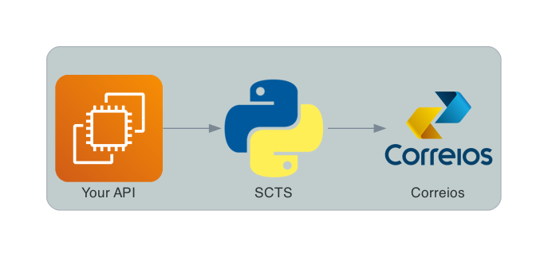

Simple Correios Tracking Service
================================
.. _badges:

.. image:: https://coveralls.io/repos/github/deniscapeto/SimpleCorreiosTrackingService/badge.svg
    :target: https://coveralls.io/github/deniscapeto/SimpleCorreiosTrackingService
    :alt: Coverage Status

.. image:: https://circleci.com/gh/deniscapeto/SimpleCorreiosTrackingService.svg?style=svg
    :target: https://circleci.com/gh/deniscapeto/SimpleCorreiosTrackingService

.. _description:

A simple API to get tracking events from Correios in a JSON format

Installation
------------

Create virtual enviroment
~~~~~~~~~~~~~~~~~~~~~~~~~

You can use the code below to create it via pyenv:

.. code:: shell

    pyenv virtualenv 3.8.0 scts

Or you can just create a virtualenv and activate:

.. code::

    python3 -m venv venv
    . venv/bin/activate

Just make sure you are using python ``3.8``.

Requirements
~~~~~~~~~~~~

STCS uses **diagram** lib that depends on `Graphviz
<https://www.graphviz.org/>`_ to render the diagram, so you need to install Graphviz to update diagrams images

.. code:: shell

    brew install graphviz

Install
~~~~~~~

.. code:: shell

    make Install
    make migrations
    make migrate

How to run it
-------------

.. code:: python

    make run

How to use it
-------------

Access:

.. code::
    
    localhost:8000/tracking/ON769530126BR 
    
in which, `ON769530126BR` is a valid tracking code from Correios

Run tests and check Coverage
----------------------------

.. code::

    make tests

Diagrams
--------

